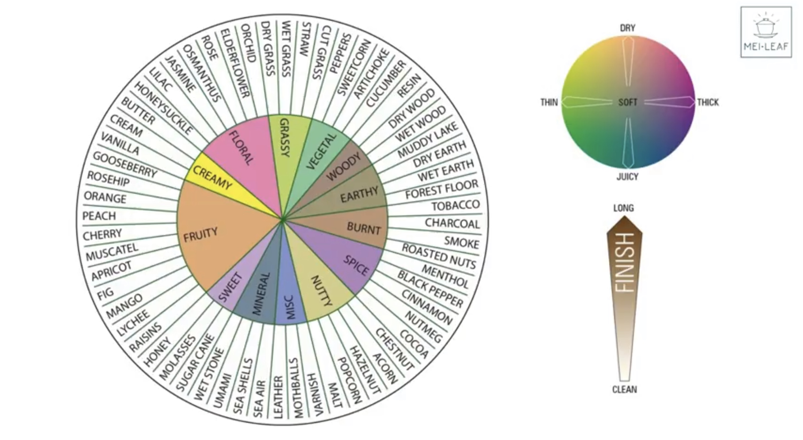

# About This Journal
[← Back to Tea Index](README.md)

This tea journal is a personal record of teas I have purchased and tasted.  
It is meant to track tasting impressions, brewing parameters, and personal preferences over time.

---

## My Rating Scale
- **1–3:** Poor, not enjoyable.
- **4–5:** Drinkable but would not repurchase.
- **6:** Decent, but has flaws or is unremarkable.
- **7:** Good tea, would consider buying again.
- **8:** Very good, enjoyable, and balanced.
- **9:** Excellent, memorable, and worth stocking up.
- **10:** Outstanding, best I’ve had in this category.

---

## Notes on Tasting
- **Dry Leaf Look:** Shape, color, uniformity.  
- **Aromas:** Noted for dry leaves, wet leaves, liquor, and empty cup.  
- **Taste:** Sweetness, bitterness, umami, complexity.  
- **Texture:** Mouthfeel (thin, thick, silky, drying, etc.).  
- **Finish:** Aftertaste and lingering sensations.

---

## Tasting Vocabulary Reference
A compact list of common descriptors for tea tasting. Used as inspiration when writing notes.

### Vegetal / Fresh
- Spinach, kale, lettuce, cucumber, zucchini  
- Seaweed, nori, wakame  
- Fresh grass, cut hay, bean sprouts  

### Floral
- Jasmine, orchid, rose, lilac, violet  
- Chamomile, chrysanthemum  
- Osmanthus, honeysuckle  

### Fruity
- Citrus (lemon, lime, orange, yuzu)  
- Stone fruit (peach, apricot, plum)  
- Berries (strawberry, raspberry, blackberry, blueberry)  
- Tropical (pineapple, mango, lychee, melon)  
- Apple, pear, grape  

### Sweet
- Honey, syrup, molasses  
- Caramel, toffee, butterscotch  
- Candy, sugarcane, marshmallow  
- Malt, sweet rice, mochi  

### Nutty / Roasted
- Almond, hazelnut, chestnut, peanut  
- Toasted grain, popcorn, roasted rice (genmaicha)  
- Coffee, cocoa nibs, dark chocolate  

### Earthy / Woody / Spicy
- Wet leaves, damp forest, moss, peat  
- Wood (cedar, oak, pine, bamboo)  
- Spices (cinnamon, clove, pepper, cardamom)  
- Herbal (licorice root, mint, sage)  

### Mineral
- Wet stone, slate, chalk, iron, spring water  

### Texture (Mouthfeel)
- Silky, creamy, velvety, buttery  
- Juicy, brothy, oily, coating  
- Drying, puckering, chalky, powdery  
- Thin, watery, crisp, refreshing  

### Finish (Aftertaste & Lingering Effects)
- Sweet, cooling, minty, mouth-watering  
- Bitter, astringent, drying  
- Umami-rich, brothy, savory  
- Floral or fruity echoes  

---

## Tasting Wheel
A visual flavour wheel to use as reference when writing tasting notes:

*Source: Mei Leaf*

---

[← Back to Tea Index](README.md)