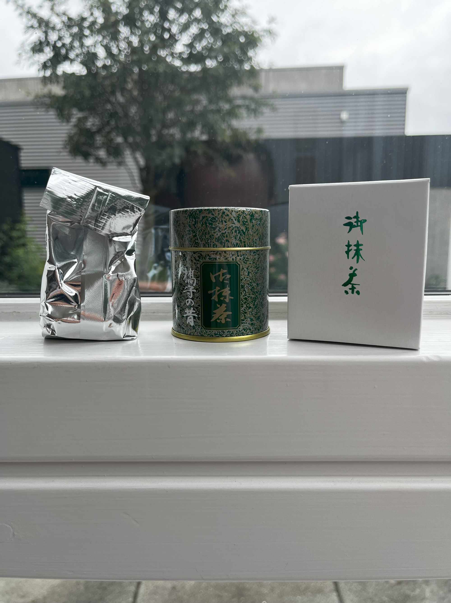
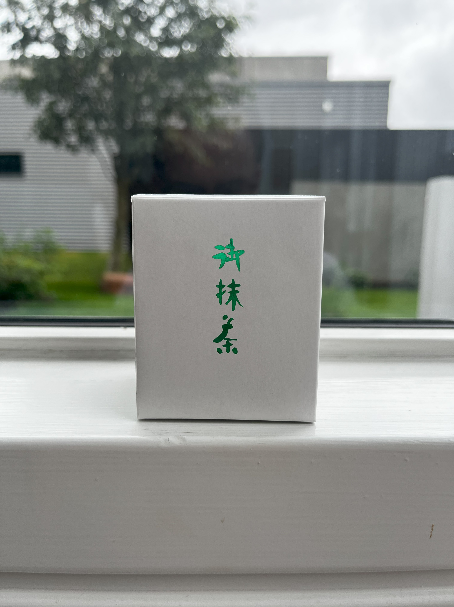
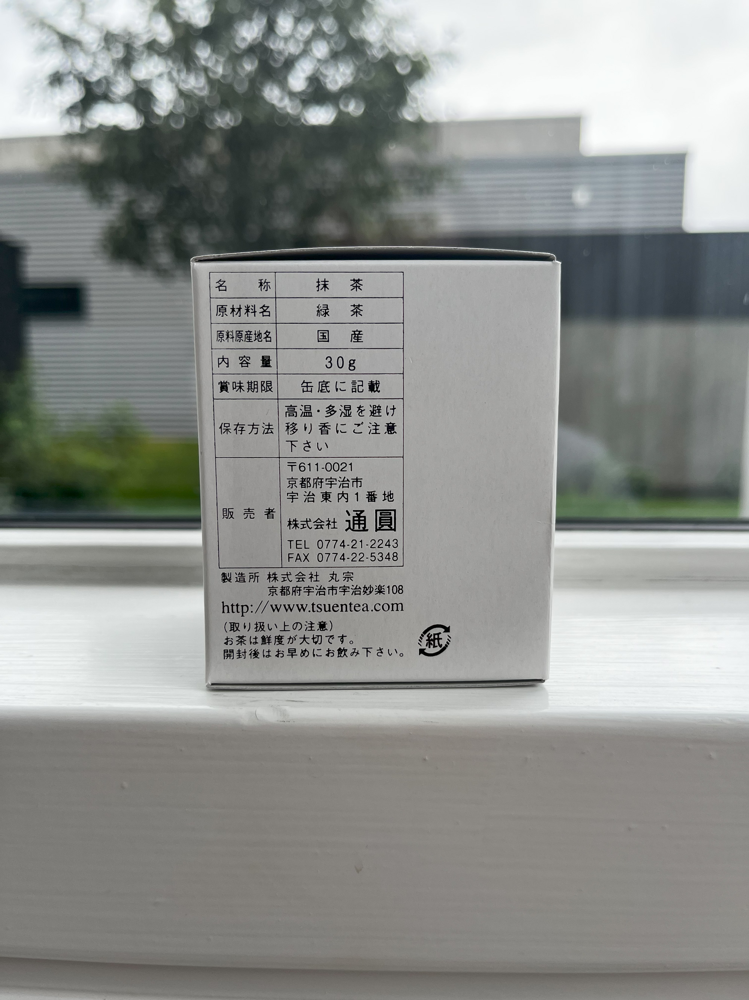
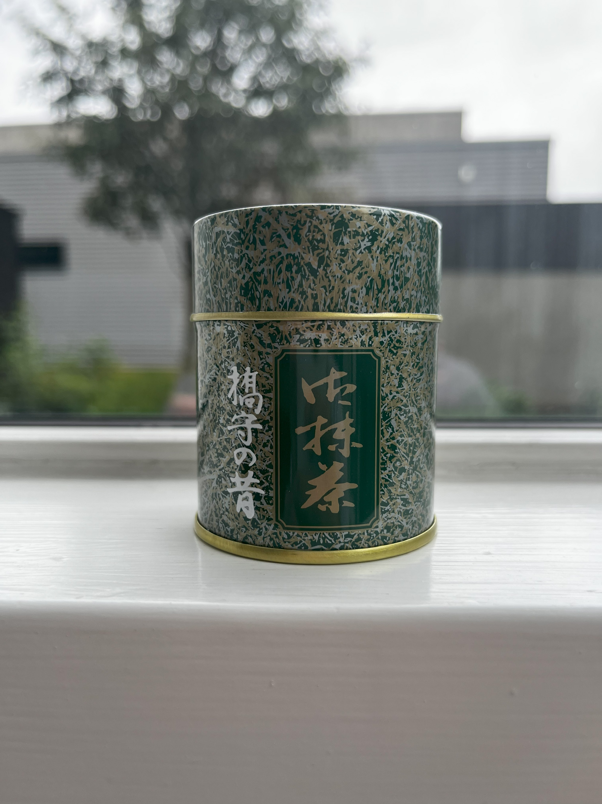
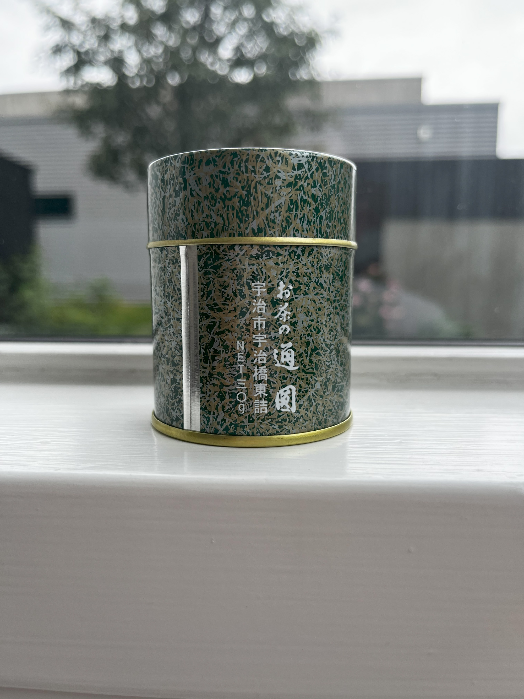
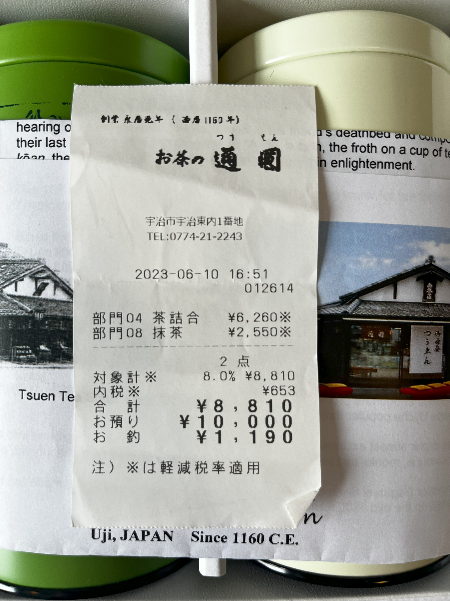
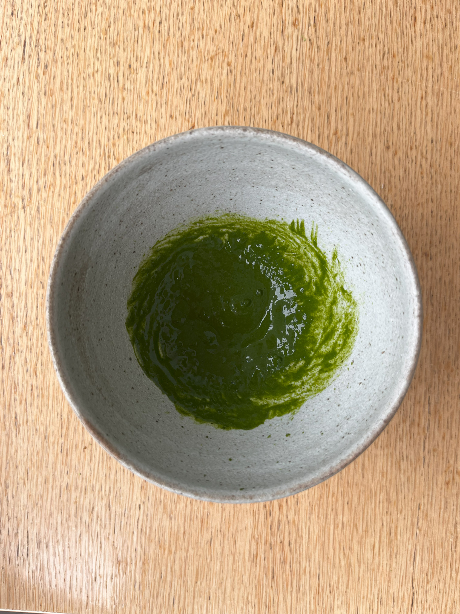
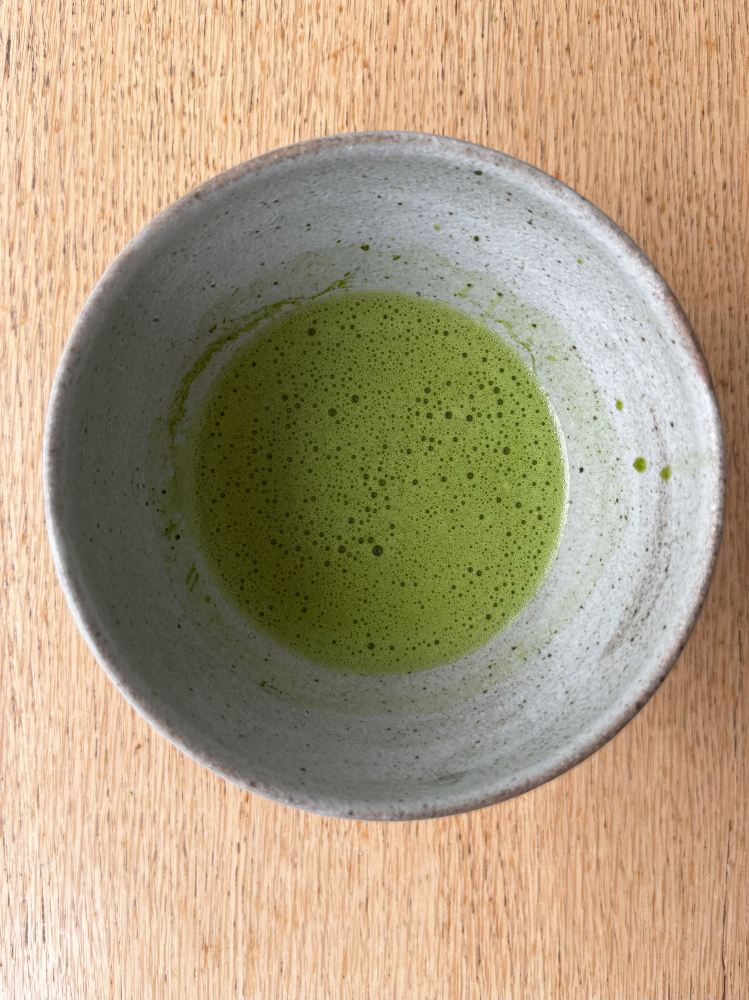

# Matcha
[← Back to Tea Index](/README.md)
- **Type:** Green Matcha
- **Description:** Matcha purchased from Tsuen Tea House in Uji, Japan in the summer of 2023.
- **Vendor:** [Tsuen](/Vendors.md#tsuen) (purchased in Uji, Japan, summer of 2023)  
- **Season:** 2023
- **Cultivar:**
- **Origin:** Uji, Japan
- **Picking & Processing:** Shade grown, steamed and dried, ground into powder.
- **Elevation:** 
- **Price:** ¥2550 / 30g 

---

## Quick Notes
- **First Impression:**  
  - (17/08/2025): Brightly coloured liquor, very deep and bitter.
- **Brew Parameters Used (Session 1):**  

| 2 Chashaku scoops / 60 ml | Temperature | Time |
|---------------|-------------|------|
| Infusion 1    | 70 °C       | ---  |

- **Equipment Used:**

| Session # | Kettle                              | Scale                              | Teapot/Gaiwan                | Pitcher                                                      | Cup                                | 
|-----------|-------------------------------------|------------------------------------|------------------------------|--------------------------------------------------------------|------------------------------------|
| 1         | [Stagg EKG](/Equipment.md#stagg-ekg) | [VST-2000](/Equipment.md#vst-2000) | --- | --- | [Matcha Bowl](/Equipment.md#other-tools) |

- **Would I Buy Again?**  
  - (17/08/2025): Yes, definetely. This is a very high-quality matcha which tastes absolutely fantastic and leaves you feeling fresh and awake.

- **Overall Rating:**  

| Session # | [Rating (1-10)](/About.md#my-rating-scale) |
|-----------|--------------------------------------------|
| 1         | 9                                          |

---

## Detailed Notes
| Date       | Session # | Dry Leaf Look      | Dry Leaf Aroma   | Wet Leaf Aroma | Liquor Look      | Texture    | Taste                                     | Empty Cup Aroma | Finish        | Wet Leaf Look     | Brewing Notes | Infusion Notes                                | Overall Impression |
|------------|-----------|--------------------|------------------|----------------|------------------|------------|-------------------------------------------|-----------------|---------------|-------------------|---------------|-----------------------------------------------|--------------------|
| 17/08/2025 | 1         | Bright, vibrant fine green powder | Sweet raspberries, fresh gelato | Sweet and fruity, watermelon and blackberries, hint of deeper, grassy notes | Green Kiwi | Very velvety smooth and soft, lightly coats the mouth and tongue., some astringency | Powerful, bitter while fresh. Umami, nuts, blackberry drops | Sweet and fresh, caramel and sweet drops | Slight pleasant dryness, smooth | Deep pine green | 2 scoops of matcha, made into paste with a but of 70° water, then mixed with a whisk with the remaining ~50 ml. Resulted in a very powerful, potent bowl | --- | A great matcha which strikes a good balance between rich bitterness and sweetness. The combination of the velvety smoothness and complex flavours make this matcha one of my favourites, although if drinking casually I would probably go for only ~1 generous scoop |

---

## Images
**Packaging:**  

**Leaves:**  

**Liquor:**  

---

[← Back to Tea Index](/README.md)