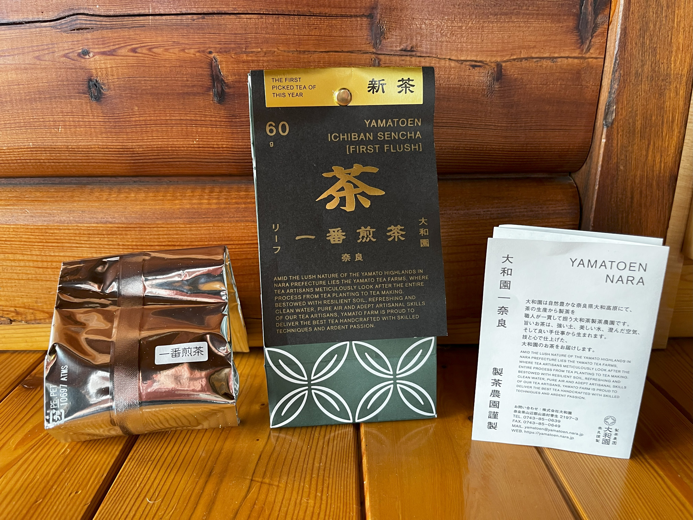
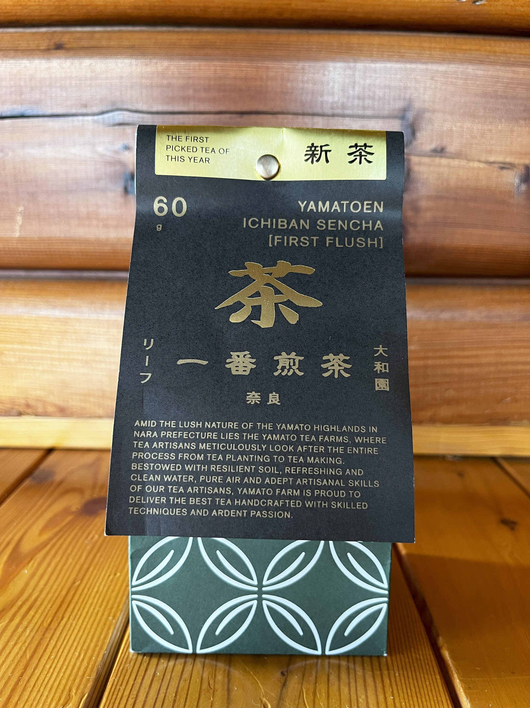
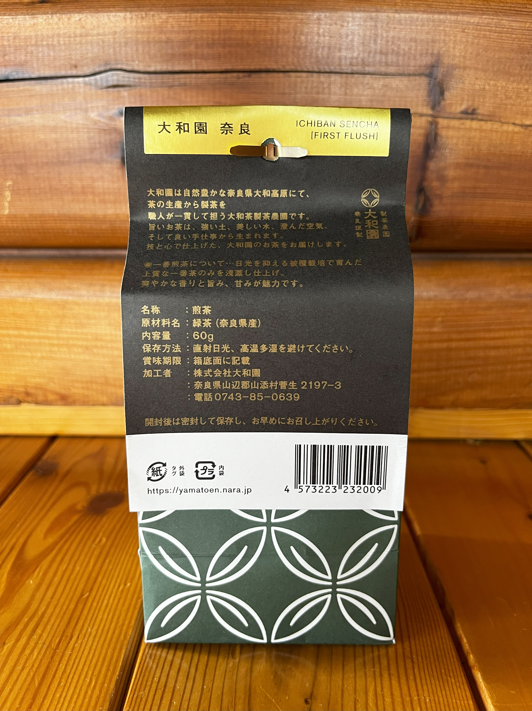
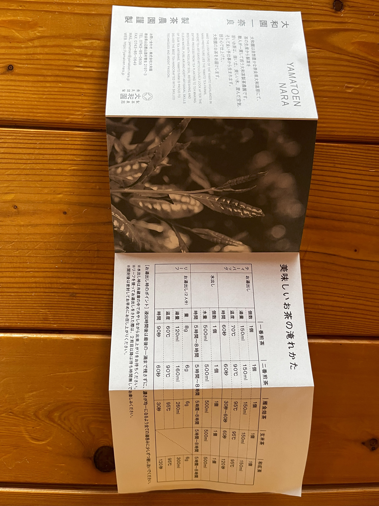

# Ichiban Sencha [First Flush]
[← Back to Tea Index](../../README.md)
- **Type:** Green Sencha  
- **Description:** First flush green tea from the Yamato Highlands in Nara 
- **Vendor:** [Yamatoen](/Vendors.md#yamatoen) (purchased in Nara, Japan on June 9, 2023)  
- **Season:** 2023 First Flush
- **Cultivar:**  
- **Origin:** Yamato Highlands, Nara, Japan  
- **Picking & Processing:** Covered  
- **Elevation:**  
- **Price:** ¥? / 60g  

---

## Quick Notes
- **First Impression:**  
  - (03/08/2025): Bright liquor. Very deep umami but lacks freshness and high notes. Feels a bit flat (possibly due to age).  
- **Brew Parameters Used (Session 1):**  

| 4.5g / 100 ml | Temperature | Time |
|---------------|-------------|------|
| Infusion 1    | 70 °C       | 90s  |
| Infusion 2    | 70 °C       | 30s  |
| Infusion 3    | 70 °C       | 60s  |
| Infusion 4    | 90 °C       | 60s  |

- **Equipment Used:**

| Session # | Kettle                              | Scale                              | Teapot/Gaiwan                | Pitcher                                                      | Cup                                | 
|-----------|-------------------------------------|------------------------------------|------------------------------|--------------------------------------------------------------|------------------------------------|
| 1         | [Lock&Lock](/Equipment.md#locklock) | [VST-2000](/Equipment.md#vst-2000) | [Kyūsu](/Equipment.md#kyūsu) | [Sky Blue Gong Dao Bei](/Equipment.md#sky-blue-gong-dao-bei) | [Sky Blue Cup](/Equipment.md#sky-blue-cups) |

- **Would I Buy Again?**  
  - (03/08/2025): Yes, but prefer richer senchas with more freshness and body.

- **Overall Rating:**  

| Session # | [Rating (1-10)](/About.md#my-rating-scale) |
|-----------|--------------------------------------------|
| 1         | 7/10                                       |

---

## Detailed Notes
| Date       | Session # | Dry Leaf Look      | Dry Leaf Aroma   | Wet Leaf Aroma | Liquor Look      | Texture    | Taste                                    | Empty Cup Aroma | Finish          | Wet Leaf Look     | Brewing Notes | Infusion Notes                                | Overall Impression |
|------------|-----------|--------------------|------------------|----------------|------------------|------------|------------------------------------------|-----------------|-----------------|-------------------|---------------|-----------------------------------------------|--------------------|
| 03/08/2025 | 1         | Dark, rich needles | Fresh cut grass  | Damp forest    | Bright, clear    | Thin       | Deep umami, low freshness, lacking highs | Faint umami     | Slight dryness  | Intact soft leaves| As above      | Try following package instructions next time | Good overall; lacks freshness and body       |

---

## Images
**Packaging:**  

**Leaves:**  
**Liquor:**  

[← Back to Tea Index](../../README.md)