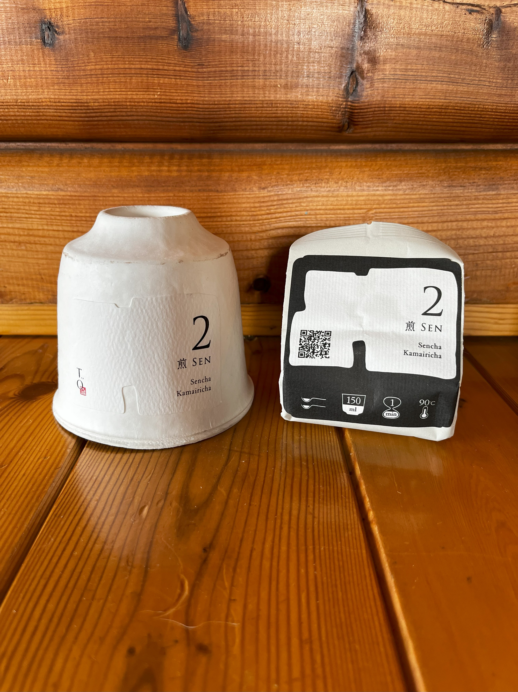
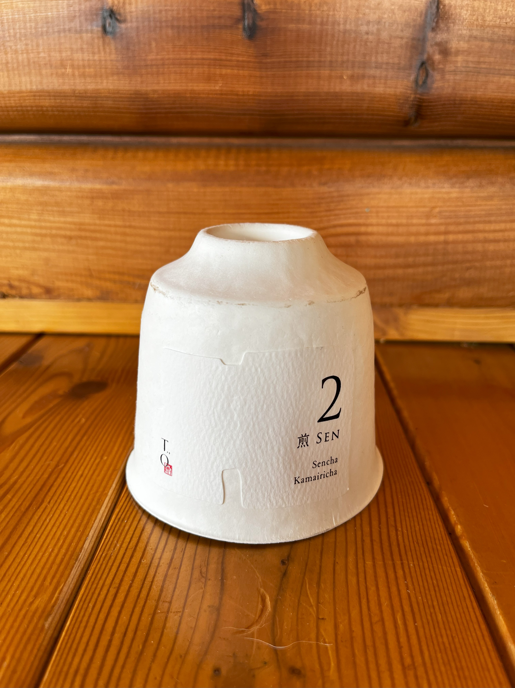
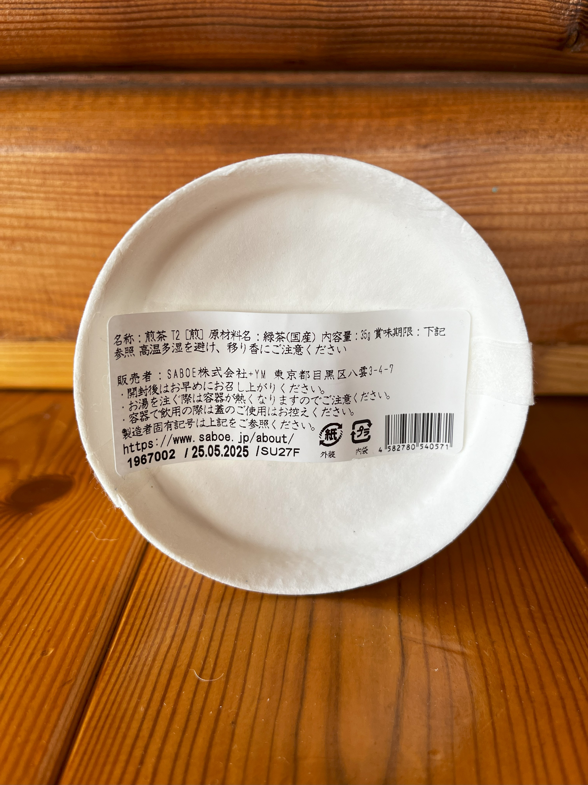
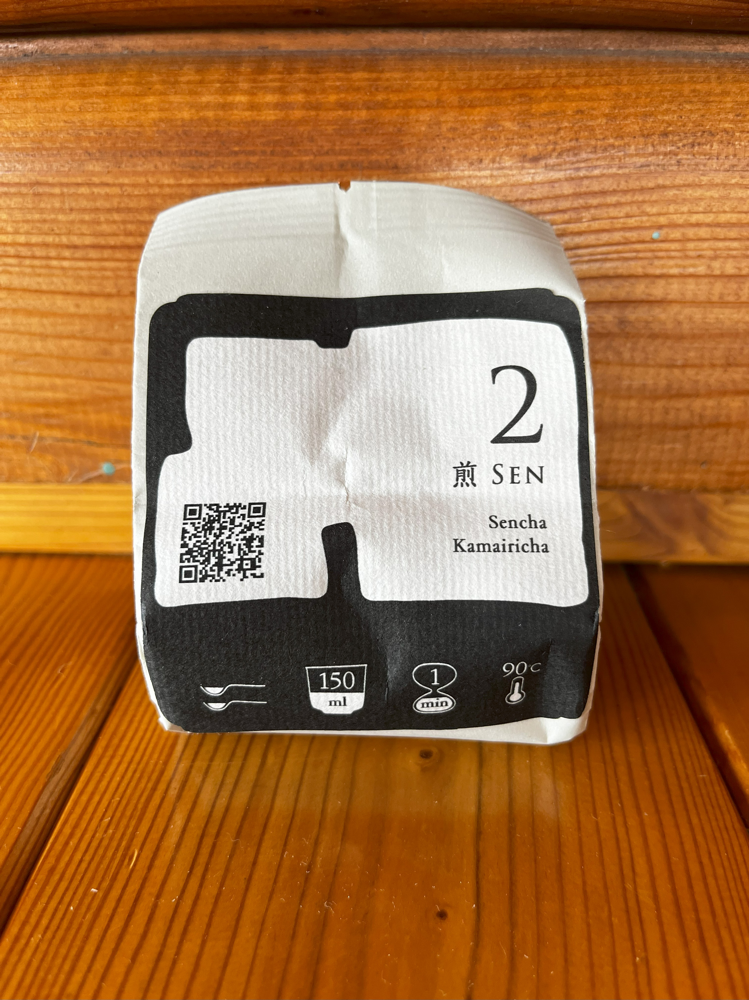
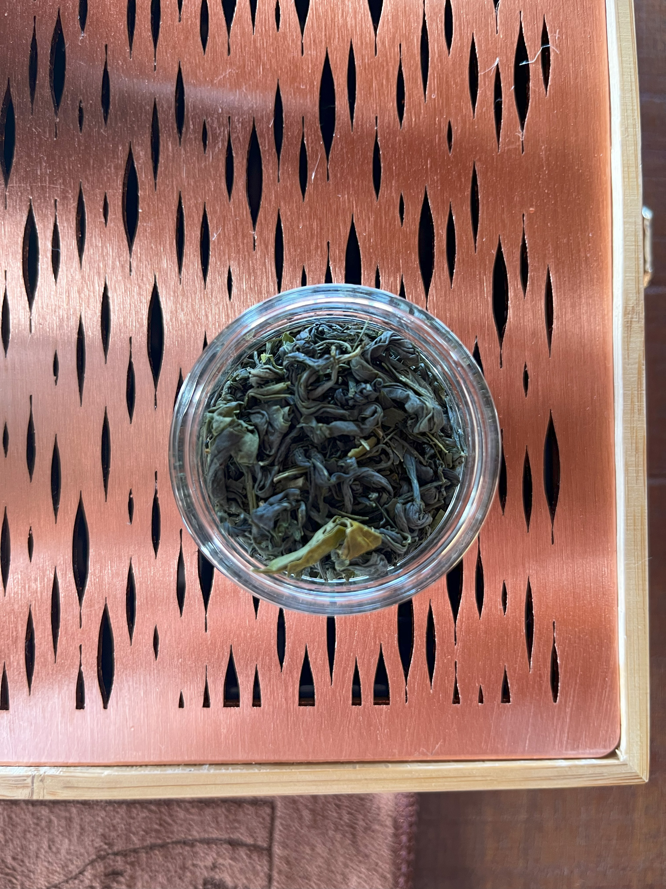
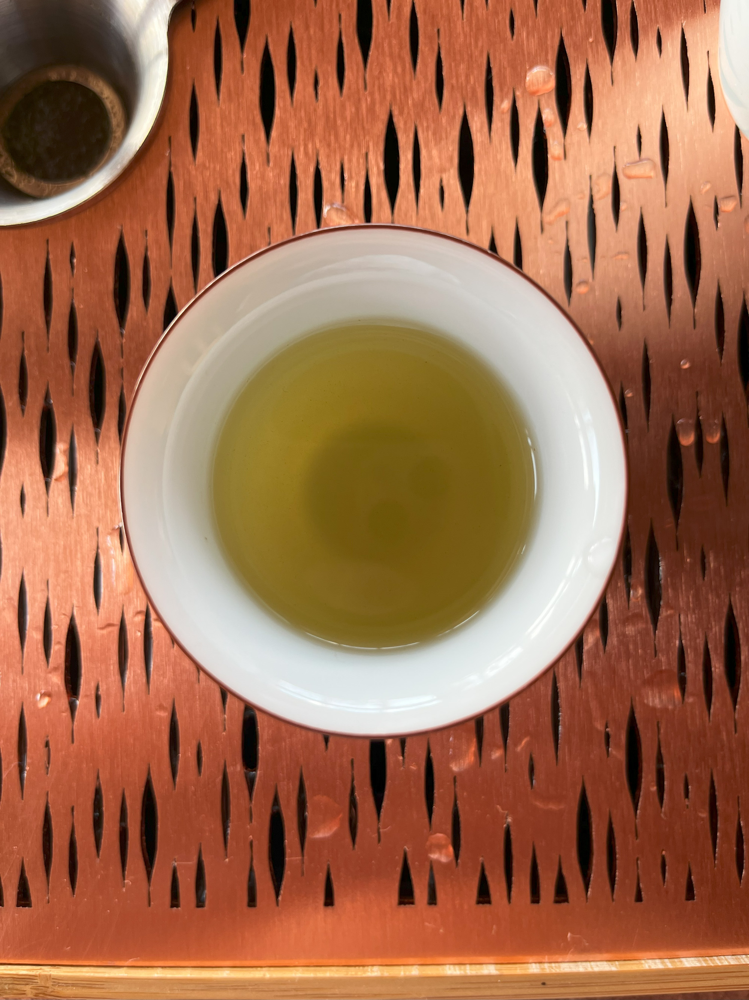

# 2 Sen
[← Back to Tea Index](/README.md)
- **Type:** Green Sencha Kamairicha
- **Description:** Carefully curated blend combining steamed Sencha with pan-roasted Kamairicha, offering a balance of crisp freshness and subtle roasted notes. Received as a gift from my sister after her trip to Japan in the summer of 2024.
- **Vendor:** [Saboe](/Vendors.md#saboe) (gift, purchased in Japan, summer of 2024)  
- **Season:** 2024
- **Cultivar:**
- **Origin:** Japan
- **Picking & Processing:** Combination of steamed leaves (Sencha) and pan-roasted leaves (Kamairicha)
- **Elevation:** 
- **Price:** ¥2916 / 35g 

---

## Quick Notes
- **First Impression:**  
  - (04/08/2025): Deep liquor, bold yet fresh, slightly bitter. 
- **Brew Parameters Used (Session 1):**  

| 4.5g / 100 ml | Temperature | Time |
|---------------|-------------|------|
| Infusion 1    | 80 °C       | 90s  |
| Infusion 2    | 80 °C       | 30s  |
| Infusion 3    | 80 °C       | 60s  |
| Infusion 4    | 90 °C       | 60s  |

- **Equipment Used:**

| Session # | Kettle                              | Scale                              | Teapot/Gaiwan                | Pitcher                                                      | Cup                                | 
|-----------|-------------------------------------|------------------------------------|------------------------------|--------------------------------------------------------------|------------------------------------|
| 1         | [Lock&Lock](/Equipment.md#locklock) | [VST-2000](/Equipment.md#vst-2000) | [Kyūsu](/Equipment.md#kyūsu) | [Sky Blue Gong Dao Bei](/Equipment.md#sky-blue-gong-dao-bei) | [Sky Blue Cup](/Equipment.md#sky-blue-cups) |

- **Would I Buy Again?**  
  - (04/08/2025): Yes. This is a great tea with a fun narrative, going from great Sencha characteristics in the first infusion and ending with a sweet, fresh Kamairicha flavour by the end. Manages to strike a great balance, and leaves the drinker feeling refreshed and ready for everything.

- **Overall Rating:**  

| Session # | [Rating (1-10)](/About.md#my-rating-scale) |
|-----------|--------------------------------------------|
| 1         | 9                                          |

---

## Detailed Notes
| Date       | Session # | Dry Leaf Look      | Dry Leaf Aroma   | Wet Leaf Aroma | Liquor Look      | Texture    | Taste                                     | Empty Cup Aroma | Finish        | Wet Leaf Look     | Brewing Notes | Infusion Notes                                | Overall Impression |
|------------|-----------|--------------------|------------------|----------------|------------------|------------|-------------------------------------------|-----------------|---------------|-------------------|---------------|-----------------------------------------------|--------------------|
| 04/08/2025 | 1         | Combination of forest green needles with lighter, thicker, curlier leaves | Freshly mown grass, hint of lemon, hay | Grassy, spring tulips, hint of melon | Deep, bit murky yet rich | Velvety, ligthly coats the mouth, low astringency | Fresh, powerful, with a hint of bitterness. Umami, mossy forest, steamed rice, nutty hint | Sweet, Cheesecake | Slight pleasant dryness, smooth | Delicate whole leaves | Temperature range chosen to maintain balance between steamed Sencha’s freshness and Kamairicha’s gentle roast. Parameters worked well | Starts to loose bitterness and boldness in favour of freshness and sweetness. Increasingly dry | An overall great tea which manages to strike the seemingly perfect balance of bold Sencha and sweet, fresh Kamairicha. The tea evolves from slightly bitter and bold to increasingly sweet and refreshing, ending on a soft, clean note |

---

## Images
**Packaging:**  

**Leaves:**  

**Liquor:**  

---

[← Back to Tea Index](/README.md)